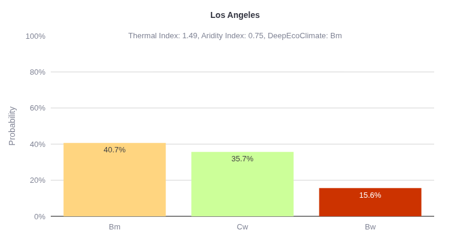

# ClimCalc - Climate Classification Calculator




[ClimCalc](https://climcalc.streamlit.app) is an interactive web application for calculating climate classifications and analyzing climate data. It provides a user-friendly interface to determine climate types for specific locations or custom data using advanced deep learning model (DeepEcoClimate) and traditional climate classification systems (Köppen-Geiger and Trewartha).

## Features

* **Climate Classification**: Calculate climate types using multiple classification systems:
  - DeepEcoClimate (Deep Learning-based)
  - Köppen-Geiger
  - Trewartha
* **Interactive Data Input**: Scrape climate data on Wikipedia for your location or input monthly temperature and precipitation values
* **Data Visualization**: View climate charts and trends for your data
* **Export Results**: Download climate data and charts

## Deploy Locally

1. **Clone the repository:**
   ```bash
   git clone https://github.com/peace-Van/ClimCalc.git
   cd ClimCalc
   ```

2. **(Recommended) Create and activate a virtual environment:**
   * Using `venv` (standard Python):
     ```bash
     python3 -m venv venv
     source venv/bin/activate
     ```
   * Or using `conda`:
     ```bash
     conda create -n climcalc python=3.10
     conda activate climcalc
     ```

3. **Install dependencies:**
   ```bash
   pip install -r requirements.txt
   ```

4. **Run the application:**
   ```bash
   streamlit run app.py
   ```

## DeepEcoClimate deep learning model usage

```python
from TorchModel import DLModel
from climate_classification import DLClassification

model = DLModel('cpu', 'inference')
model = torch.compile(model)
model.load_state_dict(torch.load('model.pth', map_location=torch.device('cpu')))
model.eval()

# data shape: (batch, 3, 12)
# 3 rows are mean daily minimum temperature (°C), precipitation (mm), mean daily maximum temperature (°C)
# 12 columns are 12 months
thermal, aridity, class_probabilities = model(data)
DEC_types = DLClassification.classify(class_probabilities)
```

## Project Structure

```
.
├── app.py                # Main Streamlit app
├── backend.py            # Data processing and analysis
├── TorchModel.py         # Deep learning model definition
├── structured_kmeans.py  # Structured KMeans clustering
├── climate_classification.py # Climate classification logic
├── requirements.txt      # Python dependencies
├── model.pth            # Pre-trained model weights
└── README.md            # Project documentation
└── LA.png               # DeepEcoClimate class probabilities for Los Angeles, California, US based on Wikipedia data
```

## Citation

If you use DeepEcoClimate in your research, please cite this repo and/or [ClimViz](https://github.com/peace-Van/ClimViz/tree/main) repo.

## License

This project is licensed under the [GNU GPLv3 License](LICENSE).

## Related Project

[ClimViz](https://github.com/peace-Van/ClimViz) - an interactive web app for exploring global climate data and visualizing climate classification world maps

## Acknowledgements

* Data provided by CRU TS, MCD12C1, GMTED2010 and Wikipedia
* Deep learning and clustering powered by MATLAB and PyTorch
* Web-based interface powered by Streamlit and Plotly